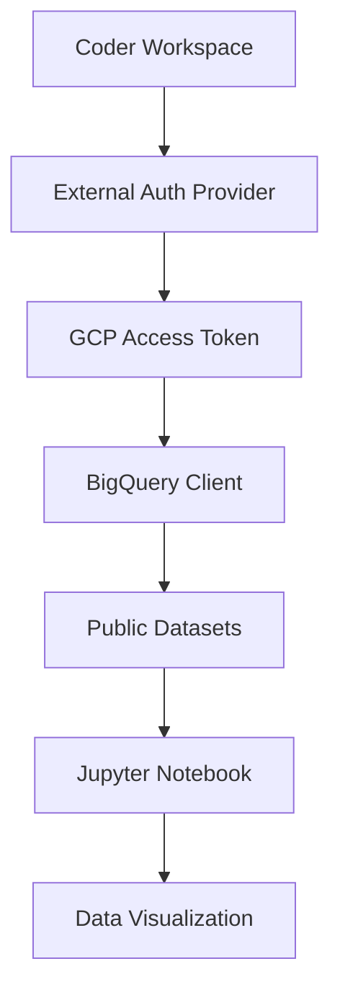

# Coder Jupyter BigQuery Integration

A complete solution for querying Google BigQuery from Jupyter notebooks using Coder's external authentication system.

## 🎯 Overview

This repository demonstrates how to:
- Authenticate with Google Cloud Platform using Coder's external auth
- Query BigQuery public datasets from Jupyter notebooks
- Perform comprehensive weather data analysis with visualizations
- Handle common authentication and dependency issues

## ⚡ Quick Start

### Prerequisites

1. **Coder workspace** with GCP external authentication configured
2. **Jupyter Lab** running in your workspace
3. **Python 3.12+** environment

### Installation

1. **Clone this repository** into your Coder workspace
2. **Install dependencies** from requirements.txt:
   ```bash
   pip install -r requirements.txt
   ```
   *Note: Example notebooks also handle installation automatically*

### External Authentication Setup Required

**🔑 IMPORTANT**: This solution requires Coder's external authentication to be properly configured for Google Cloud Platform.

Your Coder admin must have:
- Configured GCP external auth provider
- Granted appropriate BigQuery permissions
- Enabled public dataset access

To verify your setup works:
```bash
coder external-auth access-token gcp
```
This should return a valid access token.

## 📚 Analysis Notebooks & Scripts

### 1. Basic Weather Analysis
**File:** `basic-weather-analysis.ipynb`

Complete starter notebook featuring:
- ✅ Automatic requirements.txt installation and authentication setup
- 📊 Basic GSOD dataset querying (500 records)
- 🌡️ Temperature, precipitation, wind, and visibility analysis
- 📈 Weather station distribution analysis
- 🎨 Multiple visualization types

### 2. Regional Temperature Analysis
**File:** `regional-temperature-analysis.ipynb`

Advanced regional analysis notebook with:
- 🌍 Geographic region classification by station patterns
- 📊 6 comprehensive visualizations (violin plots, trends, heatmaps)
- 🌡️ Regional temperature comparisons and seasonal patterns
- 📈 Temperature vs precipitation relationships
- 🗺️ Interactive climate heatmap

### 3. Standalone Python Script
**File:** `weather-analysis-script.py`

Complete Python script version that can be run independently:
```bash
python3 weather-analysis-script.py
```

## 🔧 Authentication Method

The key breakthrough uses Coder's external auth token:

```python
import subprocess
from google.oauth2 import credentials
from google.cloud import bigquery

def get_access_token():
    result = subprocess.run(
        ['coder', 'external-auth', 'access-token', 'gcp'],
        capture_output=True, text=True, check=True
    )
    return result.stdout.strip()

# Create authenticated BigQuery client
access_token = get_access_token()
creds = credentials.Credentials(token=access_token)
client = bigquery.Client(credentials=creds, project='coder-vertex-demos')
```

## 📋 Dependencies

Install all dependencies using:
```bash
pip install -r requirements.txt
```

Or the example notebooks automatically install from requirements.txt:
```python
subprocess.check_call([sys.executable, '-m', 'pip', 'install', '-r', 'requirements.txt'])
```

**Key packages:**
- `google-cloud-bigquery` - BigQuery Python client
- `db-dtypes` - BigQuery data type support for pandas
- `pyarrow` - Efficient data serialization
- `pandas`, `matplotlib`, `seaborn` - Data analysis and visualization

## 🚀 Usage Examples

### Basic Query
```sql
SELECT * 
FROM `bigquery-public-data.samples.gsod` 
LIMIT 500
```

### Regional Temperature Analysis
```sql
SELECT 
    station_number,
    year,
    month,
    mean_temp,
    total_precipitation
FROM `bigquery-public-data.samples.gsod`
WHERE mean_temp IS NOT NULL 
  AND year >= 1950
LIMIT 5000
```

## 🎨 Sample Prompts for Claude

**🎯 Pro Tip**: Always request analysis to be done in Jupyter notebooks!

### Data Exploration
- "Show me temperature trends by geographic region in a notebook"
- "Find the wettest weather stations with visualizations"
- "Compare seasonal weather patterns across different years"
- "Identify extreme weather events with interactive plots"

### Advanced Analysis
- "Create a correlation analysis notebook for weather variables"
- "Build a time series forecasting notebook for temperature trends"
- "Make a clustering notebook for weather stations by climate patterns"
- "Create an anomaly detection notebook for unusual weather readings"

### Visualization Requests
- "Create an interactive weather dashboard in a notebook"
- "Make a comprehensive heatmap analysis of weather patterns"
- "Generate statistical plots comparing regions and seasons"
- "Build a multi-chart weather analysis notebook"

## 🔧 Troubleshooting

### Authentication Issues
```bash
# Verify external auth is working
coder external-auth access-token gcp

# Check token permissions
gcloud auth print-access-token  # Should match coder token
```

### Common Package Errors
```python
# If db-dtypes missing:
!pip install db-dtypes pyarrow

# If permission errors in Jupyter:
subprocess.check_call([sys.executable, '-m', 'pip', 'install', 'package-name'])
```

### Project Permission Issues
- Ensure you're using a valid GCP project ID
- Public datasets work with any project that has BigQuery enabled
- Default project: `'coder-vertex-demos'`

## 📊 Dataset Information

**GSOD Dataset:** `bigquery-public-data.samples.gsod`
- **Source:** Global Summary of the Day weather data
- **Coverage:** Worldwide weather stations, historical data from 1929+
- **Size:** 114+ million records, 31 columns
- **Key Fields:** temperature, precipitation, wind speed, visibility, weather events

**Sample Data Fields:**
- `station_number` - Weather station identifier
- `mean_temp` - Average temperature (°F)
- `total_precipitation` - Daily precipitation (inches)
- `mean_wind_speed` - Average wind speed (knots)
- `year`, `month`, `day` - Date information

## 🌟 Key Technical Insights

1. **Authentication**: Use `credentials.Credentials(token=access_token)` with Coder's GCP token
2. **Project ID**: Always specify a valid project even for public datasets
3. **Dependencies**: BigQuery requires `db-dtypes` and `pyarrow` for pandas integration
4. **Error Handling**: Import `subprocess` in cells where it's used
5. **Performance**: Use LIMIT clauses for initial exploration, then scale up

## 🏗️ Architecture



## 📁 Repository Structure

```
coder-jupyter/
├── README.md                          # This documentation
├── basic-weather-analysis.ipynb      # Basic weather analysis notebook
├── regional-temperature-analysis.ipynb # Advanced regional temperature analysis
├── weather-analysis-script.py        # Standalone Python script
├── requirements.txt                   # Python dependencies
├── .gitignore                        # Git ignore patterns
└── CLAUDE.md                         # Detailed technical guide
```

## 🤝 Contributing

This is an internal reference implementation. For improvements:

1. Test notebooks thoroughly with various datasets
2. Update authentication methods if Coder external auth changes
3. Add new analysis examples following the established patterns
4. Ensure all code works in fresh Jupyter environments

## 📚 Additional Resources

- [Coder External Auth Documentation](https://coder.com/docs/external-auth)
- [BigQuery Public Datasets](https://cloud.google.com/bigquery/public-data)
- [BigQuery Python Client Reference](https://cloud.google.com/bigquery/docs/quickstarts/quickstart-client-libraries)
- [GSOD Dataset Documentation](https://cloud.google.com/bigquery/public-data/samples)

---

**🎉 Ready to explore weather data with BigQuery!**

*This solution successfully handles Coder external auth, BigQuery authentication, and provides comprehensive weather analysis capabilities in Jupyter notebooks.*