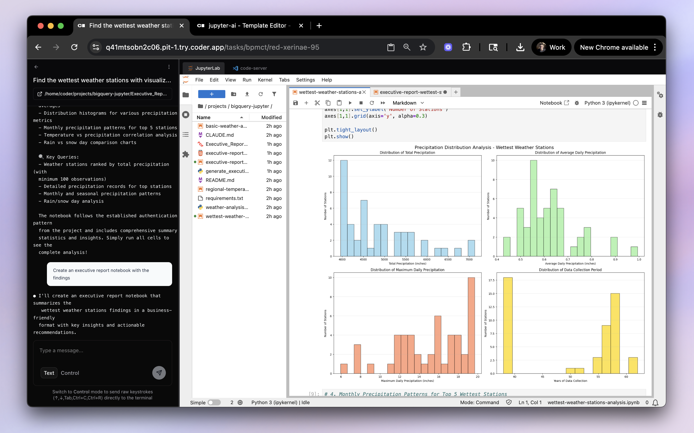
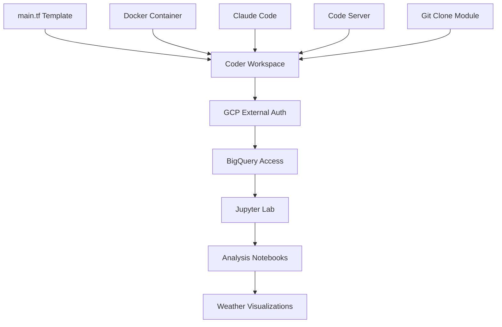

# Coder BigQuery Jupyter Template

A complete Coder workspace template for querying Google BigQuery from Jupyter notebooks with integrated GCP authentication and AI agents (Claude Code).



## 📹 Watch a demo

Before deploying, watch a video explaining how this works!

| [](https://www.loom.com/share/153e90469fb04c2db1ec0143beb32bde) | [](https://www.loom.com/share/bb3b150c8d5b48b5acc426a661490b39) |
|---|---|
| <div align="center">[**Demo:** Demo: Jupyter, BigQuery, and Coder Tasks](https://www.loom.com/share/153e90469fb04c2db1ec0143beb32bde)</div> | <div align="center">[**Behind the Scenes**: Template Code & Config](https://www.loom.com/share/bb3b150c8d5b48b5acc426a661490b39)</div> |

## 🎯 Overview

This is a **Coder workspace template** (`main.tf`) that provides:
- 🔐 **GCP External Authentication** - Pre-configured Google Cloud integration
- 📊 **Jupyter Lab** - Ready-to-use data science environment
- 🌤️ **BigQuery Integration** - Access to public weather datasets
- 🛠️ **Development Tools** - Code-server, JetBrains, and Claude Code
- ⚡ **Complete Setup** - Everything configured and ready to deploy

> [!NOTE]
> This majority of this README, while mostly accurate, is written with AI. The template itself is written by the Coder team.

## ⚡ Template Deployment

### For Coder Admins

1. **Deploy the template** to your Coder instance:
   ```bash
   # Upload main.tf as a workspace template
   coder templates push bigquery-jupyter
   ```

2. **Configure required variables**:
   - `anthropic_api_key` - For Claude Code integration
   - `docker_socket` - Docker connection (optional)

3. **Ensure GCP External Auth** is configured (see configuration section below)

### For Users

1. **Create workspace** from the `bigquery-jupyter` template
2. **Access Jupyter Lab** from the workspace dashboard
3. **Start analyzing** using the pre-loaded weather analysis notebooks

## 🔐 BigQuery Authentication Setup

**🔑 REQUIRED**: This template uses BigQuery with OpenID Connect (OIDC) authentication through Coder's external auth system.

### Step 1: Configure BigQuery OIDC

First, set up BigQuery to accept OIDC tokens from your identity provider:

1. **Enable BigQuery OIDC** in your Google Cloud project
2. **Configure identity pool** and provider for your Coder instance
3. **Set up IAM bindings** for BigQuery access

**Required Documentation:**
- [BigQuery OIDC Authentication](https://cloud.google.com/bigquery/docs/authentication/oidc)
- [Workload Identity Federation](https://cloud.google.com/iam/docs/workload-identity-federation)

### Step 2: Configure Coder External Auth

Configure your Coder deployment to provide GCP tokens that work with BigQuery OIDC:

```bash
CODER_EXTERNAL_AUTH_0_TYPE=gcp
CODER_EXTERNAL_AUTH_0_CLIENT_ID="your-gcp-client-id"
CODER_EXTERNAL_AUTH_0_CLIENT_SECRET="your-gcp-client-secret"
CODER_EXTERNAL_AUTH_0_SCOPES="https://www.googleapis.com/auth/userinfo.email https://www.googleapis.com/auth/cloud-platform https://www.googleapis.com/auth/sqlservice.login https://www.googleapis.com/auth/bigquery"
CODER_EXTERNAL_AUTH_0_AUTH_URL="https://accounts.google.com/o/oauth2/v2/auth"
CODER_EXTERNAL_AUTH_0_TOKEN_URL="https://oauth2.googleapis.com/token"
CODER_EXTERNAL_AUTH_0_DISPLAY_NAME="Google Cloud"
CODER_EXTERNAL_AUTH_0_DISPLAY_ICON="/icon/gcp.png"
```

**Additional Documentation:**
- [Coder External Auth Configuration](https://coder.com/docs/external-auth)
- [Google Cloud OAuth 2.0 Setup](https://cloud.google.com/docs/authentication/oauth)

### Template Integration

The `main.tf` workspace template automatically uses this external auth configuration:
```hcl
data "coder_external_auth" "gcp" {
  id = "gcp"
}
```

This enables seamless BigQuery access within workspaces using OIDC tokens.

#### User Verification

To verify your setup works:
```bash
coder external-auth access-token gcp
```
This should return a valid access token.

## 📚 Analysis Notebooks & Scripts

### 1. Basic Weather Analysis
**File:** `basic-weather-analysis.ipynb`

Complete starter notebook featuring:
- ✅ Automatic requirements.txt installation and authentication setup
- 📊 Basic GSOD dataset querying (500 records)
- 🌡️ Temperature, precipitation, wind, and visibility analysis
- 📈 Weather station distribution analysis
- 🎨 Multiple visualization types

### 2. Regional Temperature Analysis
**File:** `regional-temperature-analysis.ipynb`

Advanced regional analysis notebook with:
- 🌍 Geographic region classification by station patterns
- 📊 6 comprehensive visualizations (violin plots, trends, heatmaps)
- 🌡️ Regional temperature comparisons and seasonal patterns
- 📈 Temperature vs precipitation relationships
- 🗺️ Interactive climate heatmap

### 3. Standalone Python Script
**File:** `weather-analysis-script.py`

Complete Python script version that can be run independently:
```bash
python3 weather-analysis-script.py
```

## 🔧 Authentication Method

The key breakthrough uses Coder's external auth token:

```python
import subprocess
from google.oauth2 import credentials
from google.cloud import bigquery

def get_access_token():
    result = subprocess.run(
        ['coder', 'external-auth', 'access-token', 'gcp'],
        capture_output=True, text=True, check=True
    )
    return result.stdout.strip()

# Create authenticated BigQuery client
access_token = get_access_token()
creds = credentials.Credentials(token=access_token)
client = bigquery.Client(credentials=creds, project='coder-vertex-demos')
```

## 📋 Dependencies

Install all dependencies using:
```bash
pip install -r requirements.txt
```

Or the example notebooks automatically install from requirements.txt:
```python
subprocess.check_call([sys.executable, '-m', 'pip', 'install', '-r', 'requirements.txt'])
```

**Key packages:**
- `google-cloud-bigquery` - BigQuery Python client
- `db-dtypes` - BigQuery data type support for pandas
- `pyarrow` - Efficient data serialization
- `pandas`, `matplotlib`, `seaborn` - Data analysis and visualization

## 🚀 Usage Examples

### Basic Query
```sql
SELECT * 
FROM `bigquery-public-data.samples.gsod` 
LIMIT 500
```

### Regional Temperature Analysis
```sql
SELECT 
    station_number,
    year,
    month,
    mean_temp,
    total_precipitation
FROM `bigquery-public-data.samples.gsod`
WHERE mean_temp IS NOT NULL 
  AND year >= 1950
LIMIT 5000
```

## 🎨 Sample Prompts for Claude

**🎯 Pro Tip**: Always request analysis to be done in Jupyter notebooks!

### Data Exploration
- "Show me temperature trends by geographic region in a notebook"
- "Find the wettest weather stations with visualizations"
- "Compare seasonal weather patterns across different years"
- "Identify extreme weather events with interactive plots"

### Advanced Analysis
- "Create a correlation analysis notebook for weather variables"
- "Build a time series forecasting notebook for temperature trends"
- "Make a clustering notebook for weather stations by climate patterns"
- "Create an anomaly detection notebook for unusual weather readings"

### Visualization Requests
- "Create an interactive weather dashboard in a notebook"
- "Make a comprehensive heatmap analysis of weather patterns"
- "Generate statistical plots comparing regions and seasons"
- "Build a multi-chart weather analysis notebook"

## 🔧 Troubleshooting

### Authentication Issues
```bash
# Verify external auth is working
coder external-auth access-token gcp

# Check token permissions
gcloud auth print-access-token  # Should match coder token
```

### Common Package Errors
```python
# If db-dtypes missing:
!pip install db-dtypes pyarrow

# If permission errors in Jupyter:
subprocess.check_call([sys.executable, '-m', 'pip', 'install', 'package-name'])
```

### Project Permission Issues
- Ensure you're using a valid GCP project ID
- Public datasets work with any project that has BigQuery enabled
- Default project: `'coder-vertex-demos'`

## 📊 Dataset Information

**GSOD Dataset:** `bigquery-public-data.samples.gsod`
- **Source:** Global Summary of the Day weather data
- **Coverage:** Worldwide weather stations, historical data from 1929+
- **Size:** 114+ million records, 31 columns
- **Key Fields:** temperature, precipitation, wind speed, visibility, weather events

**Sample Data Fields:**
- `station_number` - Weather station identifier
- `mean_temp` - Average temperature (°F)
- `total_precipitation` - Daily precipitation (inches)
- `mean_wind_speed` - Average wind speed (knots)
- `year`, `month`, `day` - Date information

## 🌟 Key Technical Insights

1. **Authentication**: Use `credentials.Credentials(token=access_token)` with Coder's GCP token
2. **Project ID**: Always specify a valid project even for public datasets
3. **Dependencies**: BigQuery requires `db-dtypes` and `pyarrow` for pandas integration
4. **Error Handling**: Import `subprocess` in cells where it's used
5. **Performance**: Use LIMIT clauses for initial exploration, then scale up

## 🏗️ Template Architecture



## 📁 Repository Structure

```
bigquery-jupyter/
├── README.md                          # Template documentation
├── main.tf                           # 🎯 Coder workspace template (deploy this!)
├── basic-weather-analysis.ipynb      # Sample weather analysis notebook
├── regional-temperature-analysis.ipynb # Advanced regional analysis notebook
├── weather-analysis-script.py        # Standalone Python script
├── requirements.txt                   # Python dependencies for notebooks
├── .gitignore                        # Git ignore patterns
└── CLAUDE.md                         # Detailed usage guide for workspaces
```

## 🤝 Contributing

Contributions are welcome! This is a community template in the coder-contrib organization.

To contribute:

1. **Fork the repository**
2. **Test the template** by deploying to a Coder instance
3. **Verify notebooks** work in fresh workspace environments
4. **Update template** if Coder provider versions change
5. **Add new features** following established patterns
6. **Submit a pull request** with your improvements

## 📚 Additional Resources

- [Coder External Auth Documentation](https://coder.com/docs/external-auth)
- [BigQuery Public Datasets](https://cloud.google.com/bigquery/public-data)
- [BigQuery Python Client Reference](https://cloud.google.com/bigquery/docs/quickstarts/quickstart-client-libraries)
- [GSOD Dataset Documentation](https://cloud.google.com/bigquery/public-data/samples)

---

**🎉 Ready to deploy your BigQuery Jupyter template!**

*This Coder workspace template provides everything needed for BigQuery data analysis with integrated GCP authentication, development tools, and sample notebooks.*
